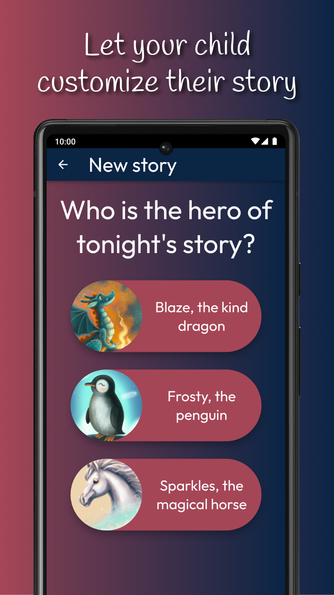
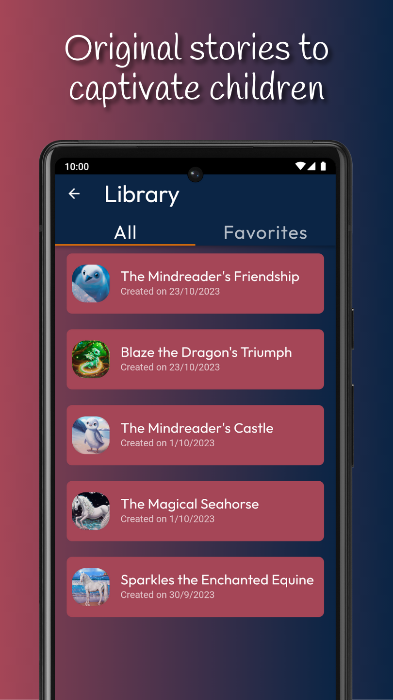
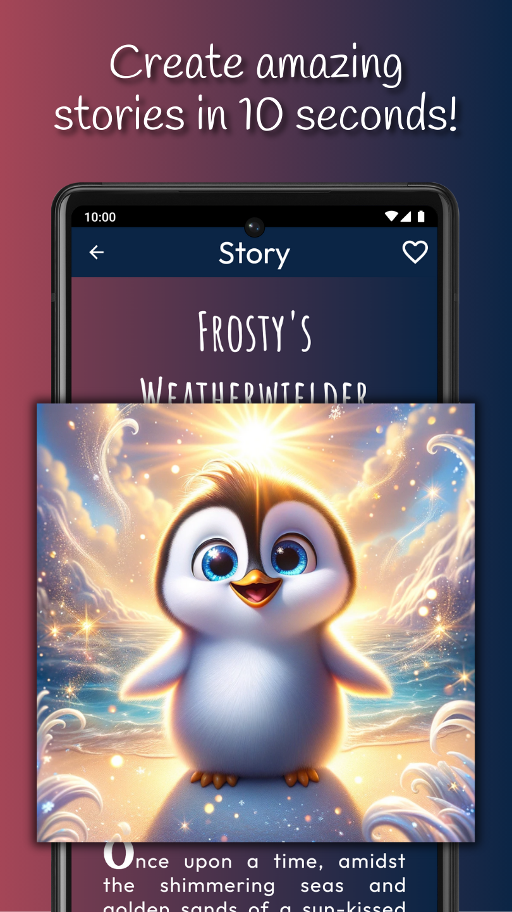
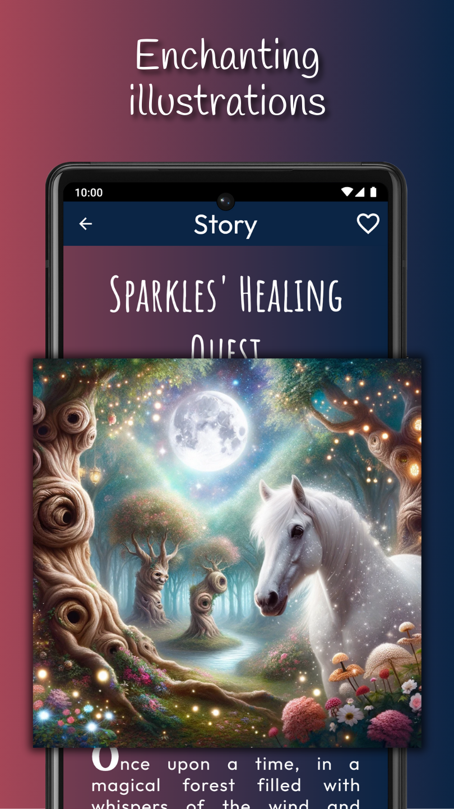
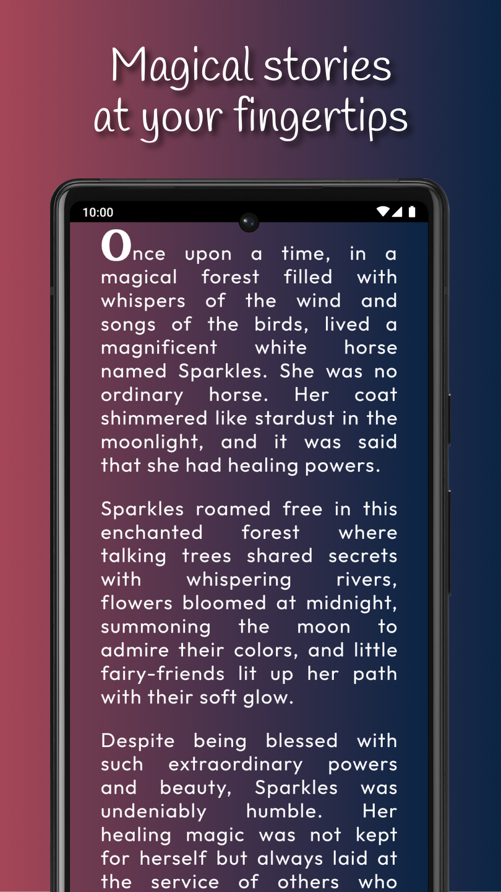

# Dreamy Tales (`bedtime-writer`)

## License

All rights reserved to Tristan Stampfler and Pierre Wan-Fat.

## Screenshots

## Documentation

* [Local setup](doc/setup.md): setup and run the project locally.
* [Deployment](doc/deployment.md): everything you need to know to deploy the project.
* [Configuration](doc/configuration.md): how to configure the project.
* [Development](doc/development.md): tips for the development.
* [Administration tools](doc/admin.md): setup and use the administration tools.
